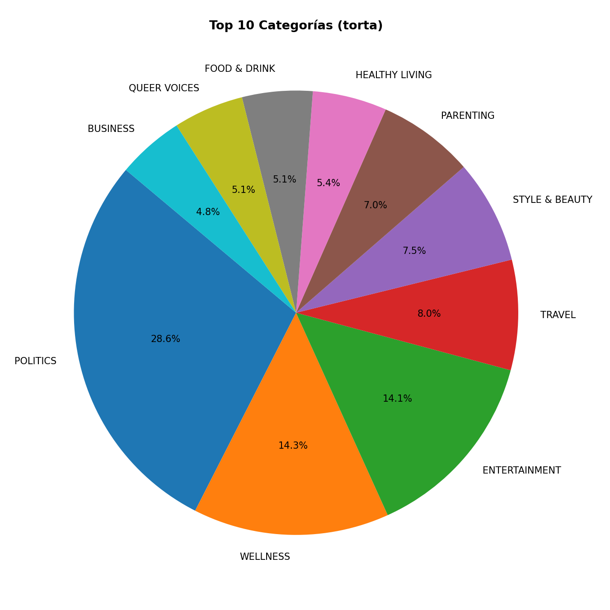

# Clasificación Automática de Noticias Mediante Machine Learning

## Imagen Representativa del Proyecto



---

## Descripción General

Sistema de clasificación multiclase supervisada que automatiza la categorización de artículos periodísticos digitales utilizando técnicas avanzadas de Procesamiento de Lenguaje Natural (NLP) y aprendizaje automático. El proyecto clasifica noticias en 30 categorías temáticas diferentes analizando el contenido textual (titular y descripción corta) de cada artículo.

## Motivación y Contexto

El crecimiento exponencial del contenido digital ha transformado la forma en que se produce y consume información periodística. Según el Digital News Report 2023, más del 60% de los usuarios accede a noticias a través de plataformas digitales, donde los sistemas de recomendación y búsqueda dependen directamente de una categorización precisa del contenido.

La clasificación manual de artículos resulta inviable a escala: un portal de noticias puede publicar cientos de artículos diarios, lo que exige criterios consistentes, personal especializado y tiempos de procesamiento incompatibles con la inmediatez del periodismo digital. Esta solución automatizada permite procesar contenido a escala sin sacrificar precisión.

## Objetivo Principal

Desarrollar un sistema de clasificación automática de noticias basado en aprendizaje supervisado que prediga la categoría temática de un artículo a partir de su contenido textual, evaluando y comparando múltiples algoritmos de Machine Learning para determinar el modelo más efectivo.

## Objetivos Específicos

- Analizar las características textuales del dataset e identificar patrones léxicos por categoría
- Preprocesar datos mediante técnicas de NLP (limpieza, normalización, vectorización TF-IDF) con selección de características Chi-squared
- Implementar y ajustar con GridSearchCV: Regresión Logística, Árbol de Decisión, Random Forest, MLP y DNN
- Evaluar desempeño con métricas estándar (accuracy, precision, recall, F1-score) y matrices de confusión
- Comparar modelos y determinar el más adecuado para clasificación de noticias

---

## Dataset

**Fuente:** [News Category Classification Dataset - Kaggle](https://www.kaggle.com/datasets/bornaetminan/news-category-classification-dataset)

### Características del Dataset

| Variable | Tipo | Rol | Descripción |
|---|---|---|---|
| `category` | Categórica | Variable objetivo (y) | Categoría temática de la noticia |
| `headline` | Texto | Feature principal | Titular del artículo |
| `short_description` | Texto | Feature principal | Resumen corto de la noticia |
| `authors` | Texto | Informativa | Autor(es) del artículo |
| `date` | Fecha | Informativa | Fecha de publicación |
| `link` | Texto | Informativa | URL original del artículo |

### Retos Técnicos Identificados

- **Alta dimensionalidad:** La representación vectorial del vocabulario genera espacios de miles de features
- **Desbalance de clases:** Algunas categorías concentran más artículos que otras
- **Ambigüedad semántica:** Categorías similares como Politics/Government comparten vocabulario

---

## Arquitectura del Proyecto

### 1. Preprocesamiento de Datos

#### Limpieza y Normalización
- Eliminación de caracteres especiales y URLs
- Conversión a minúsculas
- Tokenización del texto
- Eliminación de stopwords
- Lematización/Stemming

#### Vectorización de Texto
- Transformación mediante TF-IDF (Term Frequency-Inverse Document Frequency)
- Selección de 15,000 características principales con Chi-squared (Chi²)
- Estandarización de características

### 2. Modelos Implementados

#### Regresión Logística (Modelo 1)

**Descripción:** Modelo estadístico lineal fundamentado en teoría Bayesiana que utiliza la función sigmoide para generar probabilidades de clase.

**Características:**
- Complejidad: Baja-media (lineal)
- Interpretabilidad: Muy alta
- Velocidad: Muy rápida (entrenamiento en segundos)
- Escalabilidad: Excelente - O(n·m) lineal

**Estructura:**
- Entrada: 15,000 características
- Transformación lineal: matriz de pesos (15,000 × 30)
- Activación: Softmax para 30 clases
- Pérdida: Entropía cruzada categórica
- Optimizador: SAGA (Stochastic Average Gradient Ascent)
- Regularización: L2 (Ridge)

**Hiperparámetros Ajustados:**
- C (inverso de λ): [0.1, 0.5, 1, 5, 10]
- Penalty: L2
- Class weight: Balanceado
- Solver: LBFGS
- Max iterations: 1000

#### Árbol de Decisión (Modelo 2)

**Descripción:** Modelo no-paramétrico que particiona recursivamente el espacio de características mediante divisiones binarias basadas en criterios de impureza.

**Características:**
- Interpretabilidad: Muy alta (reglas transparentes)
- Velocidad: Muy rápida
- Sesgo-Varianza: Sesgo bajo, varianza potencialmente alta
- Sensibilidad: No requiere normalización

#### Random Forest

**Descripción:** Conjunto de árboles de decisión que utiliza bagging para reducir varianza y mejorar generalización.

#### MLP (Multilayer Perceptron)

**Descripción:** Red neuronal artificial con capas ocultas para capturar relaciones no-lineales complejas.

#### DNN (Deep Neural Network)

**Descripción:** Red neuronal profunda con múltiples capas para modelar patrones muy complejos.

---

## Estructura de Archivos

```
Proyecto final IA/
├── README.md                              # Este archivo
├── DESCRIPCION_MODELOS.md                # Documentación detallada de modelos
├── requirements.txt                       # Dependencias del proyecto
│
├── Notebooks Principales/
│   ├── Taller ML/
│   │   ├── proyecto_clasificacion_FINAL.ipynb  # Notebook principal del proyecto
│   │   ├── dataset_limpio_20260522_151119.csv  # Dataset procesado
│   │   └── archive/
│   │       ├── news_category_clean.csv
│   │       ├── news_category_ml_ready.csv
│   │       └── preparacion_datos_noticias.ipynb
│   │
│   ├── EDA.ipynb                         # Análisis Exploratorio de Datos
│   ├── proyecto_pre.ipynb                # Versión previa del proyecto
│   ├── proyecto_v_prefin.ipynb           # Versión prefinal
│   └── OTROOO.ipynb                      # Análisis adicional
│
├── Scripts Python/
│   ├── taller_ML_noticias.py            # Script principal de ML
│   ├── completar_fases_word.py          # Generación de reportes
│   └── d.py                              # Utilidades
│
├── Visualizaciones (img/)/
│   ├── distribucion_categorias_torta.png
│   ├── balanceo_barras_antes.png
│   ├── balanceo_barras_final.png
│   ├── nube_palabras_antes.png
│   ├── nube_palabras_final.png
│   ├── heatmap_terminos_por_categoria.png
│   ├── chi2_top_terminos_por_categoria.png
│   ├── Matriz_confusion_regresion_logistica_exp1.png
│   ├── Matriz_confusion_decision_Tree_exp1.png
│   ├── Matriz_confusion_decision_Tree_exp2.png
│   ├── Matriz_confusion_random_forest_NUEVA.png
│   ├── comparativa_pred_real_regresion_exp1.png
│   ├── comparativa_decision_tree_exp1.png
│   ├── comparativa_decision_tree_exp2.png
│   └── matriz_correlacion_*.png
│
└── Otros/
    ├── papers/                           # Papers de referencia
    └── rendered_docx_check/              # Reportes generados
```

---

## Dependencias

El proyecto utiliza las siguientes librerías principales:

```
pandas==3.0.2              # Manipulación de datos
numpy==2.4.4               # Operaciones numéricas
scikit-learn==1.8.0        # Modelos de ML y preprocesamiento
matplotlib==3.10.8         # Visualizaciones
seaborn==0.13.2            # Gráficos estadísticos
nltk==3.9.4                # Procesamiento de lenguaje natural
jupyter                    # Notebooks interactivos
tensorflow                 # (para modelos DNN)
scipy==1.17.1              # Operaciones científicas
```

---

## Instalación y Configuración

### Requisitos Previos

- Python 3.8 o superior
- pip o conda

### Pasos de Instalación

1. Clonar o descargar el repositorio:
```bash
cd "Proyecto final IA"
```

2. Crear un entorno virtual (recomendado):
```bash
python -m venv .venv
```

3. Activar el entorno virtual:

**Windows:**
```bash
.\.venv\Scripts\Activate.ps1
```

**Linux/Mac:**
```bash
source .venv/bin/activate
```

4. Instalar dependencias:
```bash
pip install -r requirements.txt
```

5. Ejecutar Jupyter Notebook:
```bash
jupyter notebook
```

---

## Uso y Ejecución

### Notebook Principal

Abrir y ejecutar `Taller ML/proyecto_clasificacion_FINAL.ipynb` en Jupyter Notebook. El notebook está estructurado en bloques temáticos:

1. **Bloque I:** Descripción del problema e inspección del dataset
2. **Bloque II:** Preprocesamiento y limpieza de datos
3. **Bloque III:** Análisis Exploratorio de Datos (EDA)
4. **Bloque IV:** Vectorización TF-IDF y selección de características
5. **Bloque V:** Implementación de modelos y ajuste de hiperparámetros
6. **Bloque VI:** Evaluación y comparación de modelos
7. **Bloque VII:** Conclusiones y recomendaciones

### Scripts Independientes

Para ejecutar el script de clasificación:
```bash
python taller_ML_noticias.py
```

Para generar reportes:
```bash
python completar_fases_word.py
```

---

## Resultados Principales

### Desempeño de Modelos

Los modelos fueron evaluados utilizando:
- **Accuracy:** Precisión global de clasificación
- **Precision/Recall:** Capacidad de identificar correctamente cada categoría
- **F1-Score:** Media armónica entre precision y recall
- **Matrices de Confusión:** Análisis detallado de errores por categoría

### Visualizaciones Clave

- Distribución de categorías en el dataset
- Balanceo de clases antes y después de procesamiento
- Términos más discriminativos por categoría
- Matrices de confusión para cada modelo
- Comparativas de predicciones vs valores reales

---

## Análisis Exploratorio Destacado

### Distribución de Datos
- 30 categorías temáticas distintas
- Desbalance inicial identificado y tratado
- Análisis de términos más frecuentes por categoría

### Características Lingüísticas
- Análisis de longitud de titulares y descripciones
- Identificación de palabras clave por categoría
- Correlación de términos con categorías

### Preprocesamiento de Texto
- Eliminación de ruido (URLs, caracteres especiales)
- Normalización y tokenización
- Aplicación de Chi-squared para selección de 15,000 features más relevantes

---

## Conclusiones

Este proyecto demuestra que la clasificación automática de noticias mediante aprendizaje supervisado es viable y efectiva. La combinación de técnicas de NLP estándar (TF-IDF, Chi-squared) con modelos clásicos de ML produce resultados competitivos y modelos interpretables, mientras que alternativas más complejas (Random Forest, MLP, DNN) ofrecen potencial para casos más desafiantes.

### Recomendaciones

1. La Regresión Logística ofrece un buen balance entre rendimiento e interpretabilidad
2. Random Forest mejora el desempeño pero a costo de interpretabilidad
3. Los modelos profundos (MLP, DNN) requieren más datos y ajuste fino
4. Considerar ensemble de modelos para producción
5. Monitorear desempeño en categorías problemáticas (Politics/Government)

---

## Información del Proyecto

**Materia:** Inteligencia Artificial 2026-1

**Integrantes:**
- Martinez Uribe, Juan Sebastian
- Mosquera Molina, Sergio Andres
- Vergara Vergara, Eduardo Enrique

**Fecha de Entrega:** 22 de Mayo de 2026

**Fuente de Datos:** [Kaggle - News Category Classification Dataset](https://www.kaggle.com/datasets/bornaetminan/news-category-classification-dataset)

---

## Contacto y Referencias

Para más detalles sobre la implementación de modelos, consultar `DESCRIPCION_MODELOS.md`.

Para reproducibilidad: Se utilizó `random_state=42` en todos los modelos.

---

## Licencia

Proyecto académico desarrollado para el curso de Inteligencia Artificial.

